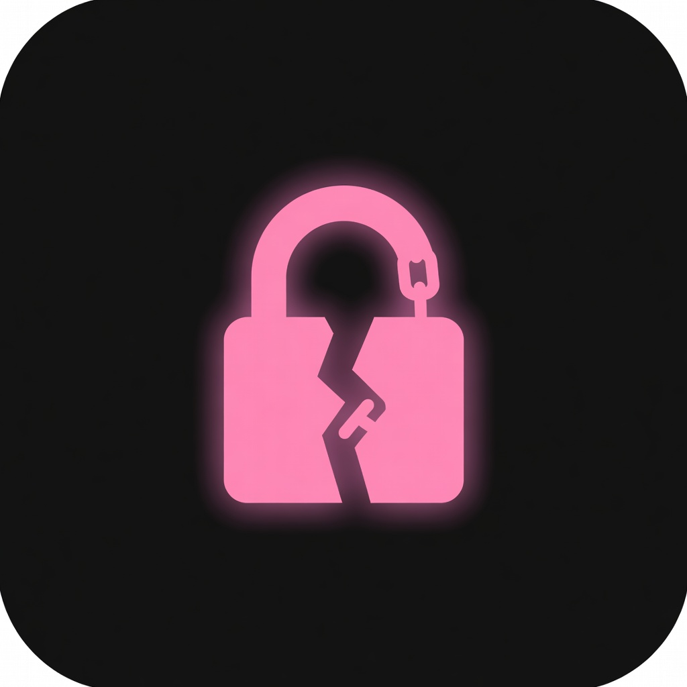

<p align="center">
  
</p>

<h1 align="center">unshackle</h1>

<p align="center">
  <strong>Modular Movie, TV, and Music Archival Software</strong><br/>
  <em>DASH · HLS · ISM · Widevine · PlayReady</em>
</p>

<p align="center">
  
  
  
</p>

<p align="center">
  <a href="#install">Install</a> ·
  <a href="#rootless--seedbox">Rootless / Seedbox</a> ·
  <a href="#quick-start">Quick Start</a> ·
  <a href="https://docs.unshackle.dev">Docs</a> ·
  <a href="https://discord.gg/mHYyPaCbFK">Discord</a>
</p>

---

> **Modified for rootless servers by Paw.** This fork runs without root, systemd,
> cron, or privileged ports — config, cache, logs, devices, and downloads default to
> your home directory and can all be overridden in `unshackle.yaml`. See
> [ROOTLESS_SETUP.md](ROOTLESS_SETUP.md) for the full guide and
> [ROOTLESS_PLAN.md](ROOTLESS_PLAN.md) for exactly what changed.

unshackle is a modular archival tool for movies, TV, and music. It parses DASH, HLS,
and Smooth Streaming (ISM) manifests, decrypts Widevine and PlayReady DRM, and muxes
the result into clean Matroska/MP4 files. A fork of
[Devine](https://github.com/devine-dl/devine/) with a REST API, remote sessions, and
a key-vault system.

---

## Features

- **DASH / HLS / ISM** manifest parsing with per-track stream selection
- **Widevine & PlayReady** DRM licensing and decryption (local CDM, remote CDM, or key vaults)
- **REST API + dashboard** (`unshackle serve`) with per-user API keys, rate limits, and remote sessions
- **Key vaults** (SQLite, MySQL, HTTP, API) for caching and sharing content keys
- **Proxy/VPN providers** (NordVPN, ExpressVPN, ProtonVPN, Surfshark, Windscribe, Hola, Gluetun, basic)
- **Metadata providers** (TMDB, TVDB, IMDB, AniList, OMDB, Simkl) with a persistent title cache
- **Scene/Plex naming templates**, folders, subtitle conversion/fonts, chapters, HDR10+/Dolby Vision, music tagging
- **Rootless by default** — same code runs as root or as an unprivileged seedbox user

## Install

```shell
uv tool install git+https://github.com/mahimmazidul/unshackle.git
unshackle --help
```

> [!TIP]
> Prefer `uv run unshackle ...` inside a clone to keep the virtual environment active.

### Manual virtualenv (no uv)

`uv` is the recommended path, but a plain Python `venv` works too and keeps
unshackle's dependencies out of your system Python:

```shell
git clone https://github.com/mahimmazidul/unshackle.git
cd unshackle
python3 -m venv .venv
source .venv/bin/activate        # Windows: .venv\Scripts\activate
python -m pip install --upgrade pip
pip install -e .                 # editable install into the venv
unshackle --help
```

`unshackle` lives inside `.venv/bin` — run it after `source .venv/bin/activate`,
or call `.venv/bin/unshackle` directly.

### Requirements

| Requirement | Version | Needed for |
| --- | --- | --- |
| [Python](https://www.python.org/) | 3.11 – 3.14 | Running unshackle |
| [uv](https://docs.astral.sh/uv/) | ≥ 0.5 | Installing/running |
| [FFmpeg](https://ffmpeg.org/) | ≥ 6.0 | Media processing & analysis |
| [MKVToolNix](https://mkvtoolnix.download/) | ≥ 80 | MKV muxing & metadata |
| [shaka-packager](https://github.com/shaka-project/shaka-packager) | 2.6.1, or ≥ 3.10.0 | DRM decryption (default) |

Optional: [Bento4](https://github.com/axiomatic-systems/Bento4) (`mp4decrypt`),
[dovi_tool](https://github.com/quietvoid/dovi_tool), HDR10Plus_tool,
[SubtitleEdit](https://github.com/SubtitleEdit/subtitleedit) (`SeConv`),
CCExtractor, MP4Box (GPAC), Caddy, Docker (Gluetun), git.

Check your environment at any time:

```shell
unshackle env check   # tool availability
unshackle env info    # resolved config/data paths
```

## Rootless / Seedbox

This fork is built to run on shared hosts. It needs **no root, no systemd, and no
privileged port**: writable paths default to your home directory and are created
automatically.

```shell
# install as your own user (uv installs into ~/.local/bin)
curl -LsSf https://astral.sh/uv/install.sh | sh
uv tool install git+https://github.com/mahimmazidul/unshackle.git

# run the REST/CDM server without systemd
./start.sh                       # default 127.0.0.1:8786
UNSHACKLE_HOST=0.0.0.0 UNSHACKLE_PORT=9000 ./start.sh
./stop.sh
```

Read **[ROOTLESS_SETUP.md](ROOTLESS_SETUP.md)** for prerequisites, default paths,
config overrides, and seedbox notes (disk quota, `/tmp`, NFS locks, process limits).

## Quick Start

1. Create a config (copy the example and fill in a CDM + output templates):

   ```shell
   mkdir -p ~/.config/unshackle
   cp unshackle/unshackle-example.yaml ~/.config/unshackle/unshackle.yaml
   ```

2. Add a Widevine device and check the environment:

   ```shell
   unshackle wvd add device.wvd
   unshackle env check
   ```

3. Download a title:

   ```shell
   unshackle dl SERVICE TITLE
   ```

4. (Optional) serve your CDM + REST API for remote use:

   ```shell
   unshackle serve --host 0.0.0.0 --port 8786
   ```

See the [documentation](https://docs.unshackle.dev) for the full CLI reference,
configuration guide, and REST API spec.

## Project layout

```
unshackle/
├── core/            # manifest parsing, DRM, downloader, config, services, REST API
├── commands/        # CLI subcommands (dl, serve, env, wvd, prd, search, util, cfg, …)
├── services/        # per-service code (swappable; may be pulled from git repos)
├── vaults/          # key-vault backends (SQLite, MySQL, HTTP, API)
├── utils/           # helpers
├── docs/            # mkdocs-material documentation
├── start.sh         # rootless launcher (nohup + pid file)
└── stop.sh          # rootless stopper
```

## Contributing

Bugs, service modules, and docs improvements are welcome. Keep service code private;
keep the core free and open. See [CONTRIBUTING.md](CONTRIBUTING.md).

## Disclaimer

unshackle is intended for archiving content **you have the rights to**. Respect the
law, the terms of the services you use, and the rights of content owners. This project
is not responsible for how you use it.

## License

[GPL-3.0](LICENSE) · Maintained fork by [mahimmazidul](https://github.com/mahimmazidul) —
upstream [unshackle-dl/unshackle](https://github.com/unshackle-dl/unshackle), forked from
[Devine](https://github.com/devine-dl/devine/). Rootless modifications by Paw.
